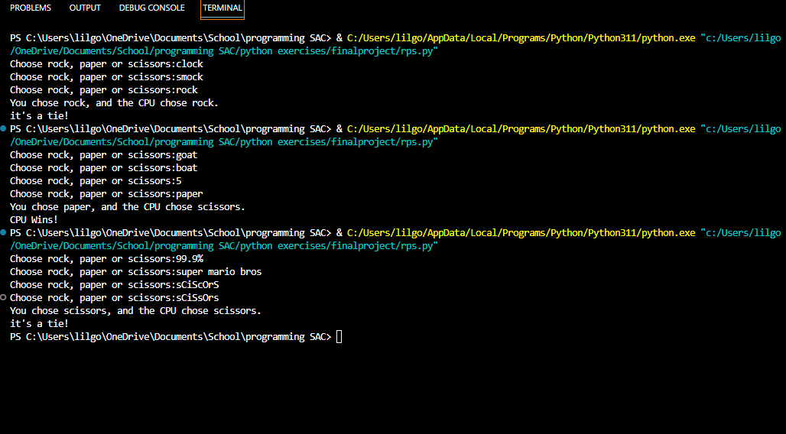

# Final Project - Rock, Paper, Scissors

The final project for ITSE 1302 is a Python console version of rock, paper,
scissors. The user chooses one of the three options, the computer selects a
random option, and the program reports the winner.

## Files

- [`rps.py`](rps.py) - Python source for the console game
- [`screenshots/output.png`](screenshots/output.png) - Example console output
- [`screenshots/rps_code.png`](screenshots/rps_code.png) - Screenshot of source code
- [`screenshots/rps_code_contd.png`](screenshots/rps_code_contd.png) - Continued source screenshot

## Screenshot



## Running It

From the repository root:

```powershell
python finalproject/rps.py
```
